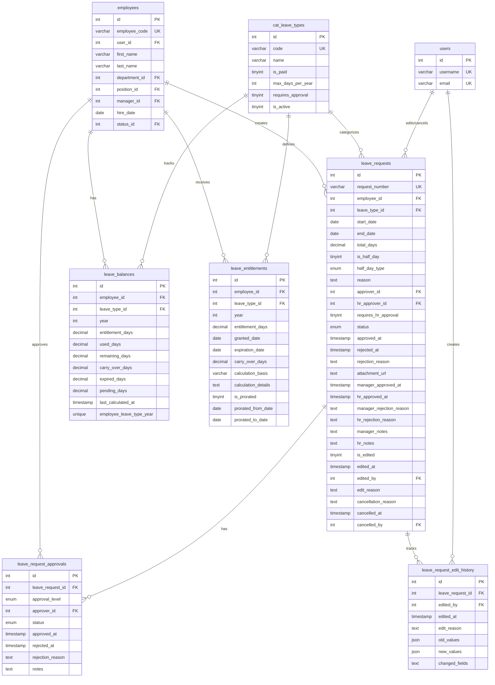

# ERD: Leave Management (Nghỉ Phép)

## 📋 Tổng Quan

**Module**: HR Management - Leave Management  
**Feature ID**: FEAT-008-006  
**Database**: `Hien_DigiERP_LeHuy_Dev2`  
**Version**: 1.0  
**Last Updated**: November 2025

---

## 🗺️ Entity Relationship Diagram

### Mermaid Diagram

---

## 📊 Relationships

### 1. employees ↔ leave_requests
- **Type**: One-to-Many
- **Description**: Một nhân viên có thể tạo nhiều yêu cầu nghỉ phép
- **Foreign Key**: `leave_requests.employee_id` → `employees.id`
- **Cascade**: ON DELETE CASCADE

### 2. employees ↔ leave_balances
- **Type**: One-to-Many
- **Description**: Một nhân viên có nhiều leave balance (theo từng loại nghỉ và năm)
- **Foreign Key**: `leave_balances.employee_id` → `employees.id`
- **Cascade**: ON DELETE CASCADE
- **Unique Constraint**: (employee_id, leave_type_id, year)

### 3. employees ↔ leave_entitlements
- **Type**: One-to-Many
- **Description**: Một nhân viên có nhiều leave entitlement (theo từng loại nghỉ và năm)
- **Foreign Key**: `leave_entitlements.employee_id` → `employees.id`
- **Cascade**: ON DELETE CASCADE

### 4. employees ↔ leave_request_approvals (as approver)
- **Type**: One-to-Many
- **Description**: Một nhân viên (Manager/HR Manager) có thể phê duyệt nhiều leave requests
- **Foreign Key**: `leave_request_approvals.approver_id` → `employees.id`
- **Cascade**: ON DELETE RESTRICT

### 5. leave_requests ↔ leave_request_approvals
- **Type**: One-to-Many
- **Description**: Một leave request có thể có nhiều approval records (multi-level approval)
- **Foreign Key**: `leave_request_approvals.leave_request_id` → `leave_requests.id`
- **Cascade**: ON DELETE CASCADE

### 6. leave_requests ↔ leave_request_edit_history
- **Type**: One-to-Many
- **Description**: Một leave request có thể có nhiều lần chỉnh sửa (audit trail)
- **Foreign Key**: `leave_request_edit_history.leave_request_id` → `leave_requests.id`
- **Cascade**: ON DELETE CASCADE

### 7. cat_leave_types ↔ leave_requests
- **Type**: One-to-Many
- **Description**: Một loại nghỉ phép có thể được sử dụng trong nhiều leave requests
- **Foreign Key**: `leave_requests.leave_type_id` → `cat_leave_types.id`
- **Cascade**: ON DELETE RESTRICT

### 8. cat_leave_types ↔ leave_balances
- **Type**: One-to-Many
- **Description**: Một loại nghỉ phép có thể có nhiều leave balance records
- **Foreign Key**: `leave_balances.leave_type_id` → `cat_leave_types.id`
- **Cascade**: ON DELETE RESTRICT

### 9. cat_leave_types ↔ leave_entitlements
- **Type**: One-to-Many
- **Description**: Một loại nghỉ phép có thể có nhiều entitlement records
- **Foreign Key**: `leave_entitlements.leave_type_id` → `cat_leave_types.id`
- **Cascade**: ON DELETE RESTRICT

### 10. users ↔ leave_requests (as editor/canceller)
- **Type**: One-to-Many
- **Description**: Một user có thể chỉnh sửa/hủy nhiều leave requests
- **Foreign Keys**: 
  - `leave_requests.edited_by` → `users.id`
  - `leave_requests.cancelled_by` → `users.id`
- **Cascade**: ON DELETE SET NULL

### 11. users ↔ leave_request_edit_history
- **Type**: One-to-Many
- **Description**: Một user có thể tạo nhiều edit history records
- **Foreign Key**: `leave_request_edit_history.edited_by` → `users.id`
- **Cascade**: ON DELETE RESTRICT

---

## 🔑 Key Constraints

### Primary Keys
- `leave_requests.id`
- `leave_balances.id`
- `leave_entitlements.id`
- `leave_request_approvals.id`
- `leave_request_edit_history.id`

### Unique Constraints
- `leave_requests.request_number` (UNIQUE)
- `leave_balances(employee_id, leave_type_id, year)` (UNIQUE)

### Foreign Key Constraints
- Tất cả foreign keys đều có constraints để đảm bảo referential integrity
- CASCADE cho employee relationships (khi xóa employee, xóa các records liên quan)
- RESTRICT cho leave type relationships (không cho phép xóa leave type đang được sử dụng)
- SET NULL cho user relationships (khi xóa user, set NULL thay vì xóa records)

---

## 📈 Data Flow

### Leave Request Lifecycle
1. **Create**: Employee tạo leave request → Status: PENDING
2. **Manager Approval**: Manager phê duyệt → Status: APPROVED (nếu không cần HR approval) hoặc PENDING (nếu cần HR approval)
3. **HR Approval** (nếu cần): HR Manager phê duyệt → Status: APPROVED
4. **Update Balance**: Khi approved, tự động cập nhật `leave_balances.used_days` và `pending_days`
5. **Edit/Cancel**: Employee có thể edit/cancel → Tự động restore balance nếu cần
6. **History Tracking**: Mọi thay đổi được ghi vào `leave_request_edit_history`

### Leave Balance Calculation
1. **Entitlement Grant**: System tự động tạo `leave_entitlements` record khi grant entitlement
2. **Balance Update**: System tự động cập nhật `leave_balances` dựa trên:
   - Entitlement days từ `leave_entitlements`
   - Used days từ approved `leave_requests`
   - Pending days từ pending `leave_requests`
   - Carry-over days từ năm trước
   - Expired days (nếu có)

---

## 🎯 Business Rules

1. **Leave Balance**: Mỗi employee chỉ có 1 balance record per leave type per year
2. **Leave Request**: Mỗi employee không thể có overlapping approved/pending leave requests
3. **Approval Workflow**: 
   - Single-level: Manager approval only
   - Multi-level: Manager → HR Manager (nếu `requires_hr_approval = 1`)
4. **Balance Calculation**: 
   - `remaining_days = entitlement_days + carry_over_days - used_days - pending_days - expired_days`
   - Tự động tính toán khi có thay đổi
5. **Edit/Cancel**: 
   - Chỉ có thể edit/cancel khi status = PENDING hoặc APPROVED
   - Khi edit/cancel, tự động restore balance nếu đã được approve

---

**Last Updated**: November 2025  
**Version**: 1.0

